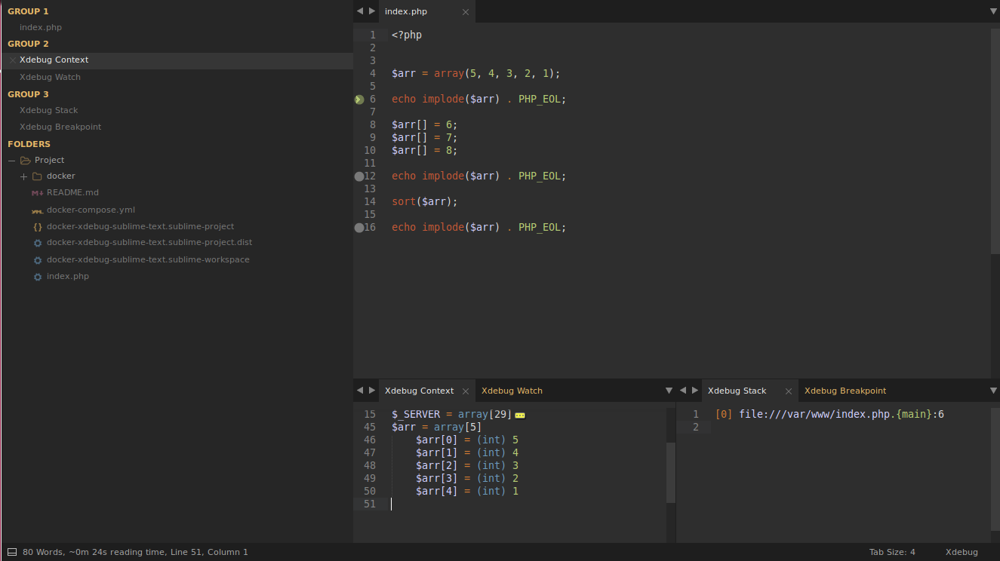
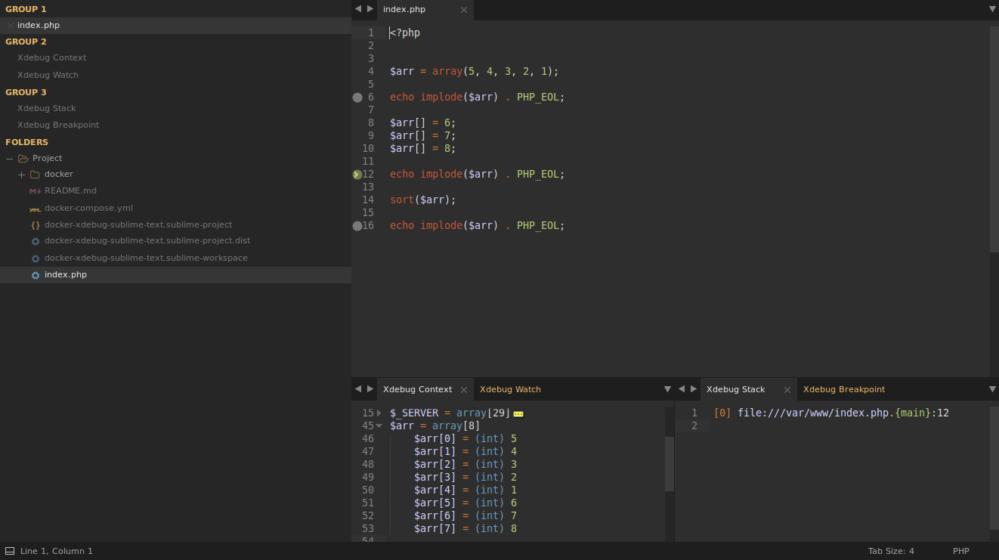
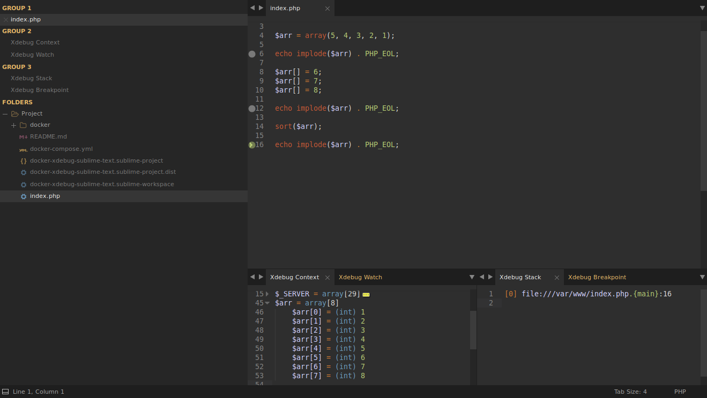

# Using Xdebug with Docker and Sublime Text

## Set up Docker container
- [docker-compose.yml](./docker-compose.yml)
- [Dockerfile](./docker/web/Dockerfile)

## Set up PHP
```ini
zend_extension=/usr/lib/php5/20100525/xdebug.so

xdebug.remote_enable=1
xdebug.remote_host=172.17.0.1
xdebug.remote_port=9000
xdebug.idekey=xdbg
xdebug.remote_cookie_expire_time=36000
xdebug.remote_connect_back=1
```

## Set up Sublime Text
```yaml
{
    "folders": [{
        "name": "Project",
        "path": ".",
        "follow_symlinks": true,
    }, ],
    "settings": {
        "xdebug": {
            "path_mapping": {
                "/var/www/": "/{my}/{local}/{dir}",
            },
            "url": "http://localhost",
            "port": 9000,
            "ide_key": "xdbg",
        }
    },
}
```

## Start Docker container
```bash
docker-compose up
```

## Start debugging
```
Tools > Xdebug > Start Debugging

OR

Shift + Ctrl + F9
```

## Watch and enjoy



